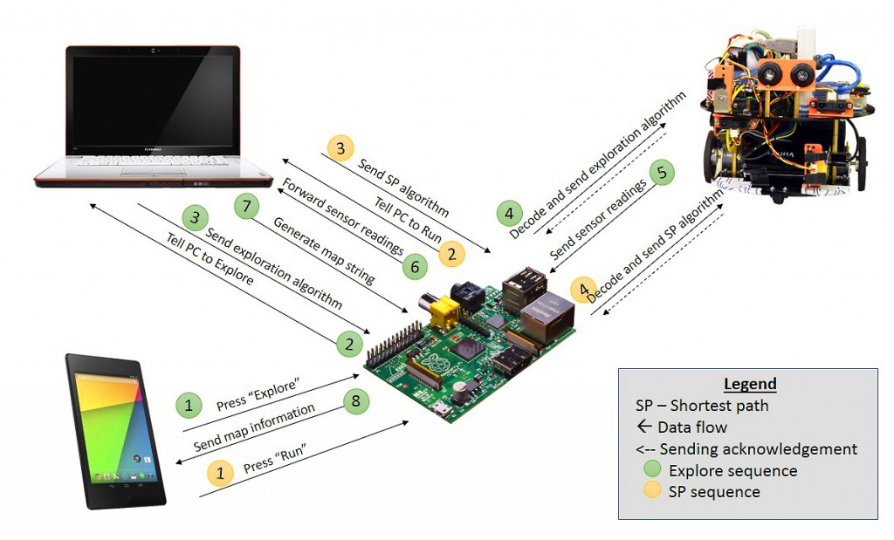

Robot Exploring the Random Maze - 2014 Spring
==============
###Welcome to Fork.
####Multi-disciplinary Design Project. 
####Nanyang Technological University, Singapore.   

Overview
==============

Algorithm Requirements
==============
PC is running the algorithm.  
See the ./algorithm/README.md

Arduino Requirements
==============
Arduino is for Robot control.  
See the ./arduino_motor/README.md

Raspberry Pi Requirements
==============
Raspberry Pi is for communication middle man coordinating PC, Arduino, and Android.  
See the ./raspberry/README.md

Branch Convention
==============
This repo follows the git-flow convention. Releases and hotfixes are maintained in the master branch. Development happens in the develop branch. 

