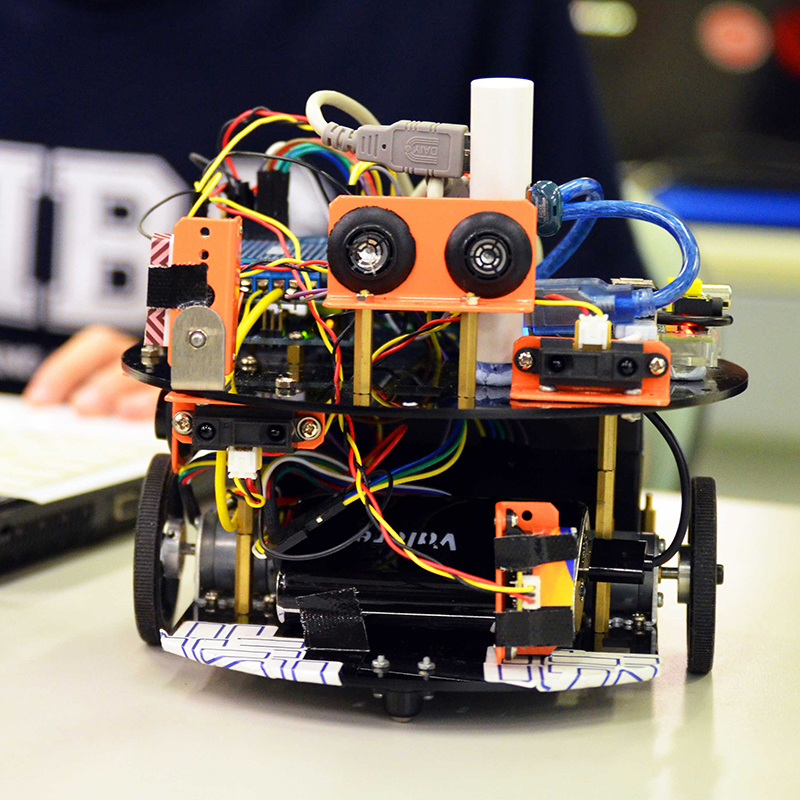

ntu.sce.mdp.15
==============
Nanyang Technological University  
Multi-disciplinary Design Project  

Arduino Requirements
==============
See the ./arduino_motor/README.md

Raspberry Requirements
==============
See the ./raspberry/README.md

Branch Convention
==============
This repo follows the git-flow convention. Releases and hotfixes are maintained in the master branch. Development happens in the develop branch. 